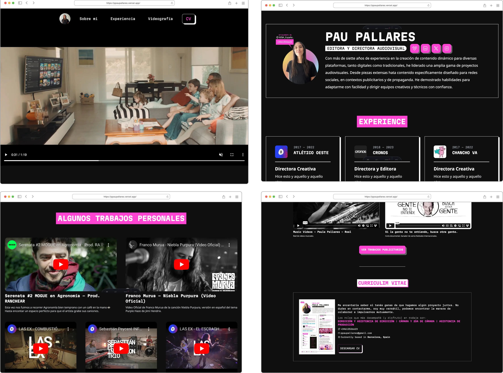

# 🎬 Audiovisual Portfolio

## 🚀 Sobre el proyecto

Este es un proyecto de portfolio audiovisual creado para mostrar una colección de videos que representan mi trabajo como profesional del diseño audiovisual. La plataforma está desarrollada utilizando Astro, lo que proporciona una experiencia web rápida y eficiente.

## 👀 Características

★ Visualización de Videos: Explora una variedad de videos que muestran mi trabajo en diferentes proyectos y áreas de especialización.
★ Interfaz Intuitiva: Navega fácilmente a través del portfolio gracias a una interfaz intuitiva y amigable para el usuario.
★ Responsive: Disfruta del portfolio en cualquier dispositivo, ya sea móvil, tablet o desktop, gracias al diseño responsive.


<p align="center" >
<a href="https://ppaupallares.vercel.app"></a>
</p>


> Work in Progress: Algunas características aún están en desarrollo, incluyendo:

✦ Link a Proyectos de Publicidad: Próximamente podrás acceder a proyectos específicos de publicidad para ver más ejemplos de mi trabajo.
✦ Traducción a Inglés: Se está trabajando en la traducción del contenido del portfolio al inglés para una audiencia más amplia.
✦ Color Switch: Próximamente podrás cambiar entre modo oscuro y modo claro.


### Uso
Clona este repositorio en tu máquina local.

```sh
  git clone https://github.com/ssanjua/ssanjua-filmmaker-web.git
```

Instala las dependencias del proyecto utilizando npm o yarn.

```sh
  npm install
```

Ejecuta el proyecto localmente utilizando npm start o yarn start.

```sh
  npm run dev
```

***Contribución***

¡Las contribuciones son bienvenidas! Si tienes alguna sugerencia, mejora o corrección, no dudes en abrir un issue o enviar un pull request.
