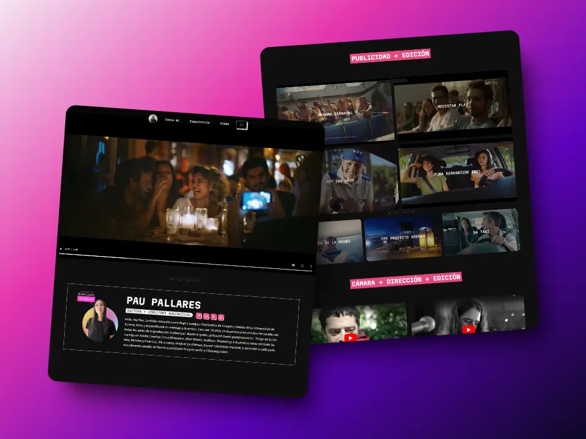

# 🎬 Portfolio Audiovisual 👀

## 🚀 Sobre el proyecto

Les presento mi página web donde se pueden ver algunos de mis proyectos como Diseñadora de Imagen y Sonido. La web está desarrollada utilizando Astro, lo que proporciona una experiencia web rápida y eficiente.

### 😍 Tecnologías

         
 

> Work in Progress: Algunas características aún están en desarrollo, incluyendo:

✦ Traducción a Inglés: Se está trabajando en la traducción del contenido del portfolio al inglés para una audiencia más amplia.
✦ Color Switch: Próximamente podrás cambiar entre modo oscuro y modo claro.

### 👀 Quieres saber más?

    

***Contribución***

¡Las contribuciones son bienvenidas! Si tienes alguna sugerencia, mejora o corrección, no dudes en abrir un issue o enviar un pull request.
